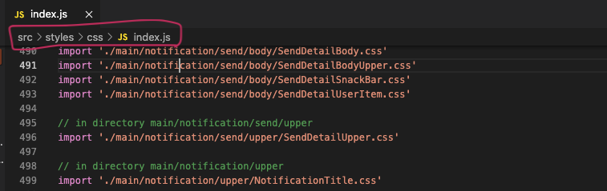

> It has no use if you're keeping your css file with related component in same directory

But we often keep all css-files under some `css-root` directory.<br>
In that case, this executable receives that `css-root-path` and

1. recursively scans every `scss`, `css`, `sass` files under `css-root-path`
2. generates single file at `destination` which contains all import statements.
   It's available for both Windows(win32) and MacOS(Posix) environment

## How To Use

1. Install the package

```shell
yarn add css-import-generator
# or
npm i css-import-generator
```

2. Add below to package.json

```json
"css-import-generator": {
   "css-root":"src/styles/css",
   "destination":"src/css-imports.js",
}
```

- `css-root` is necessary. If not given, it won't work.
- `destination` field is optional. If not given, generated file will be at under `{css-root}/index.js`

3. Run below code **at project root path**

```
npx css-import-generator
```

## ScreenShots

I'm using it for big project 😀


